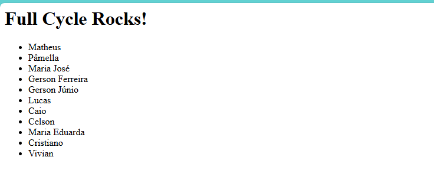

Desafio FullCycle 3.0

Enunciado: 

Nesse desafio você colocará em prática o que aprendemos em relação a utilização do nginx como proxy reverso. A idéia principal é que quando um usuário acesse o nginx, o mesmo fará uma chamada em nossa aplicação node.js. Essa aplicação por sua vez adicionará um registro em nosso banco de dados mysql, cadastrando um nome na tabela people.

O retorno da aplicação node.js para o nginx deverá ser:

<h1>Full Cycle Rocks!</h1>

- Lista de nomes cadastrada no banco de dados.

Gere o docker-compose de uma forma que basta apenas rodarmos: docker-compose up -d que tudo deverá estar funcionando e disponível na porta: 8080.

Não esqueça de colocar o volume na aplicação para o ambiente de desenvolvimento. 

Suba tudo em um repositório e faça a entrega.

* A linguagem de programação para este desafio é Node/JavaScript

---

# Resolução
A aplicação foi desenvolvida em NodeJs utilizando Express e Mysql2.

Para compilar a aplicação e gerar a imagem, execute o comando abaixo:

```bash
docker compose up -d --build
```

Para acessar a aplicação, acesse o endereço http://localhost:8080

Segue abaixo uma imagem da aplicação em execução:




Imagens Docker utilizadas:

[NodeJs]
https://hub.docker.com/_/node

[Nginx]
https://hub.docker.com/_/nginx

[Mysql]
https://hub.docker.com/_/mysql